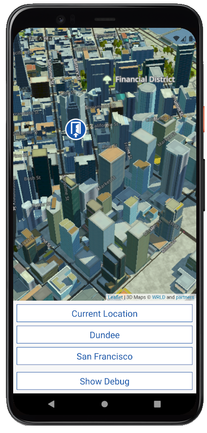
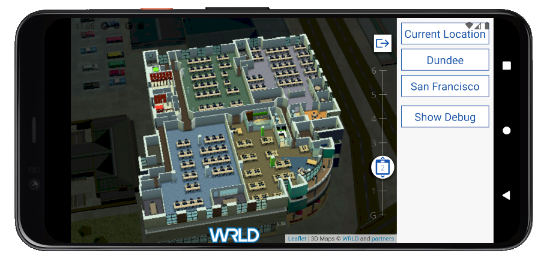

<a href="https://www.wrld3d.com/">
    
</a>

# wrld.js in React Native

**Note**: [wrld.js](https://github.com/wrld3d/wrld.js) does not officially support [React Native](https://reactnative.dev/). Make use of this example at your own risk.

This is an example of how [wrld.js](https://github.com/wrld3d/wrld.js) could be used in a [React Native](https://reactnative.dev/) app using [Expo](https://docs.expo.io/).

### Requirements

*   [Node.js](https://nodejs.org/en/) (v12.8.2 tested)
*   npm (installed with Node.js)
*   [Expo CLI](https://docs.expo.io/workflow/expo-cli/) installed globally (v4.4.2 tested)
    ```sh
    npm i -g expo-cli
    ```
*   If using a physical device:
    -   [Expo Development Client](https://expo.io/tools#client) for Android or iOS installed on your device.
*   If using an Android emulator or iOS simulator
    -   See [here](https://docs.expo.io/workflow/android-studio-emulator/) for Android emulators
    -   See [here](https://docs.expo.io/workflow/ios-simulator/) for iOS simulators
*   A [WRLD API key](https://accounts.wrld3d.com/#/tab-keys) which can be obtained by signing up for a free account at [wrld3d.com](https://wrld3d.com)

You can view the example on your Android device in the [Expo Development Client](https://expo.io/tools#client). Just paste this url https://exp.host/@wrld3d/Wrld/index.exp?sdkVersion=39.0.0 into the Client or open the Client and point it at the QR code here: https://expo.io/@wrld3d/projects/Wrld

## Getting started

### Installation

In the repo root, run:
```sh
npm install
```

### Building the example

1. Insert your [WRLD API key](https://accounts.wrld3d.com/#/tab-keys) [here](/src/config.json)

1. Compile the WebView source code into inline html.
    ```sh
    npm run build:webview
    ```
    You will need to rerun this command whenever you make any changes inside [_src/webView_](/src/webView) or [_src/shared_](src/shared)

1. Run the following command:

    ```sh
    npm start
    ```

    This will start a local server running the app and you will be presented with a QR code. Use this QR code to open the app in the [Expo Development Client](https://expo.io/tools#client) on your device.

    If using an emulator, Open your emulator and follow the instructions in the terminal.




## How it works

The example works by inserting a [`Wrld.map`](https://www.wrld3d.com/wrld.js/latest/docs/api/L.Wrld.map/) into a [_WebView_](https://www.npmjs.com/package/react-native-webview). We create the map in [_src/webView/MapController.js_](/src/webView/MapController.js#L25) and handle communication between the _WebView_ and _React Native_ in [_src/webView/WebViewMessenger.js_](/src/webView/WebViewMessenger.js#L16) and [_src/app/map/WrldMap/ReactNativeMessenger.js_](/src/app/map/WrldMap/ReactNativeMessenger.js#L20)

Currently the _WebView_ only sends information about the current state of the map to _React Native_. First on the [_`initialstreamingcomplete`_](https://www.wrld3d.com/wrld.js/latest/docs/api/L.Wrld.map/#events) event and every 500ms during the map [_`move`_](https://www.wrld3d.com/wrld.js/latest/docs/leaflet/L.Map/#map-map-state-change-events) event. If we need to call methods on the [`Wrld.map`](https://www.wrld3d.com/wrld.js/latest/docs/api/L.Wrld.map/) from a response to data or an action within _React Native_ we can do so by posting messages, i.e. [_`map_setview`_](/src/app/map/WrldMap/WrldMap.js#L43), which can be received and acted upon within the _WebView_ in [_src/webView/MapController.js_](/src/webView/MapController.js#L21).

See [here](https://github.com/react-native-webview/react-native-webview/blob/74872a1f02c43e425f19739b1b25f5fbe614ba1f/docs/Guide.md#communicating-between-js-and-native) for more information on communicating between a _WebView_ and _React Native_.

## Limitations

*   WebGL does not work on all mobile devices.
*   [wrld.js](https://github.com/wrld3d/wrld.js) is not optimized for mobile. See the [Android](https://www.wrld3d.com/android/latest/docs/examples/) and [iOS](https://www.wrld3d.com/ios/latest/docs/examples/) SDKs for full mobile support.

## License

This example is released under the Simplified BSD License. See [LICENSE.md](LICENSE.md) for details.
